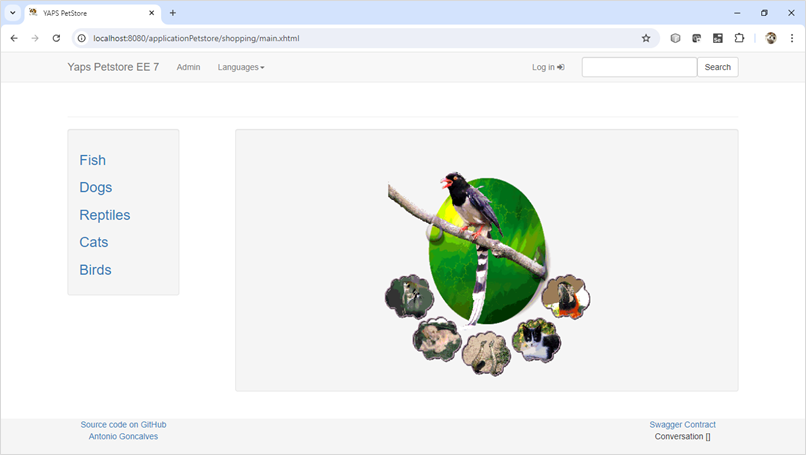

# Práctica 1.1. Revisión de un ejemplo de Arquitectura de un Sistema Monolítico 

## Objetivo de la práctica:
Al finalizar la práctica, serás capaz de:
- Analizar y comprender en detalle la estructura y funcionamiento de una arquitectura monolítica mediante el estudio de un ejemplo.

## Duración aproximada:
- 30 minutos.

## Instrucciones 
### Tarea 1. Análisis de la aplicación provista en el curso
**Paso 1.** Revise de manera detallada la implementación provista por su instructor

* [Application - Petstore Java EE 7](https://github.com/agoncal/agoncal-application-petstore-ee7)

* [Introducing the Java Pet Store 2.0 Application](https://www.oracle.com/technical-resources/articles/javaee/pet-store-application.html)

**Paso 2.** Discusión

a. ¿Posee aplicaciones n-tier en su organización?, ¿Si/no?, ¿Por qué?

b. ¿Cuáles son las ventajas y costos de las aplicaciones n-tier?

* Cambios, mantenimiento, despliegue, etc.
    
**Paso 3**. Típicamente, ¿Cómo se mejoran las características de calidad de las soluciones n-tier?

### Tarea 2. Despliegue (Opcional)
**Paso 1.** Clonar el repositorio

**Paso 2.** Construir el proyecto con Maven

**Paso 3.** Desplegar la aplicación en un servidor de aplicacion compatible con Java EE 7, por ejemplo WildFly

**Paso 4.** Despliega el archiv **WAR** generado en la carpeta **target** al servidor WildFly

**Paso 5.** Acceder a la aplicación [Petstore EE 7](http://localhost:8080/applicationPetstore)

### Resultado esperado

  

