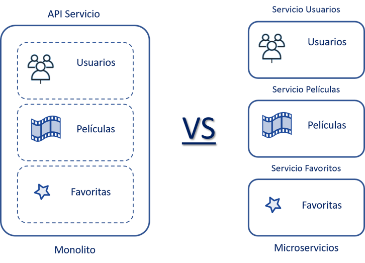
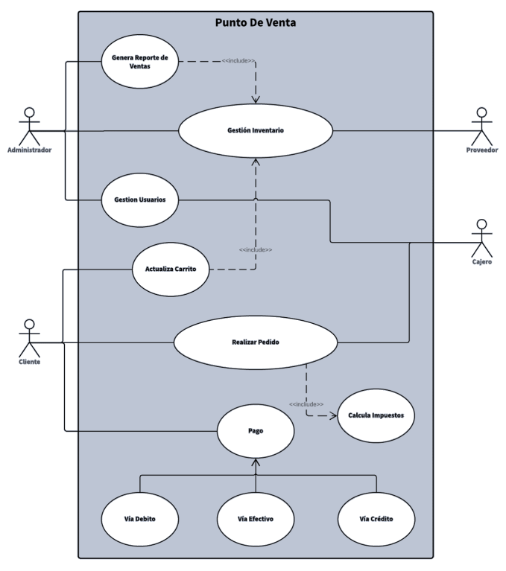
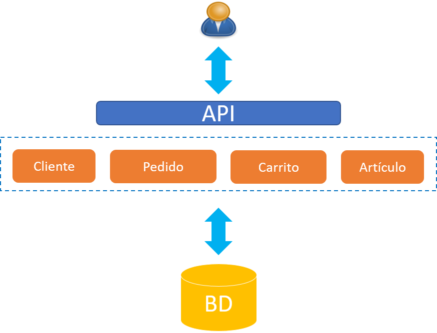
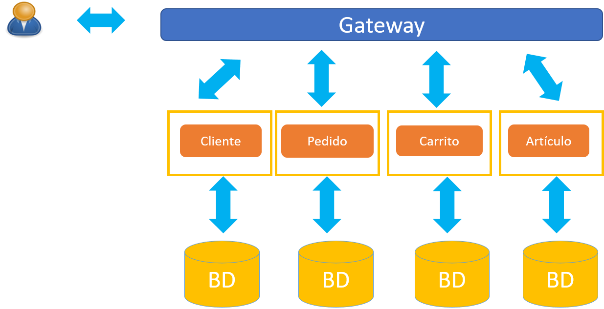

# Práctica 2.1. Diseño de Microservicios 

## Objetivo de la práctica:
Al finalizar la práctica, serás capaz de:
- Identificar y separar componentes y servicios dentro de un sistema monolítico para convertirlos en microservicios independientes.

## Objetivo Visual

    

## Duración aproximada:
- 90 minutos.

## Instrucciones 

### Tarea 1. Planteamiento general del caso de estudio

* Sistema de software que permite automatizar un punto de venta. Debe modelar el proceso típico de adquisición de artículos median un carrito de compras (selección, eliminación, generación del comprobante de compra, facturación, etc.). Además de la administración de los elementos necesarios para la operación (Artículos, Clientes, etc.).

* Los requerimientos iniciales son delineados en el diagrama de casos de uso siguiente.

  

 
**Paso 1.**

Sin restricciones o acotamientos metodológicos genera el o los modelos que consideres nos permitan la implementación del caso de estudio descrito.

**Paso 2.** Discusión  

a. La discusión va determinada por los siguientes cuestionamientos:

1. ¿La propuesta de solución fue afectada por los temas vistos en la introducción del taller?
2. ¿La propuesta es 'cloud-native'?, ¿si/no?, ¿por qué?
3. ¿Qué tecnologías propone para la implementación? ¿Por qué motivos?

### Resultados esperados
 
**Posible Solución I**

  

**Posible Solución II*

  

