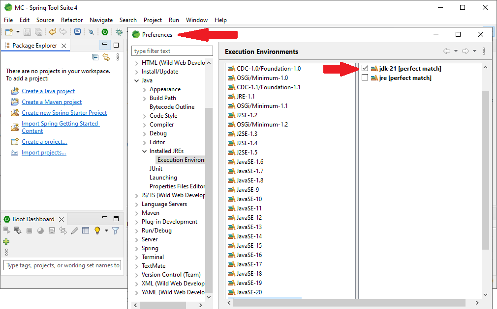
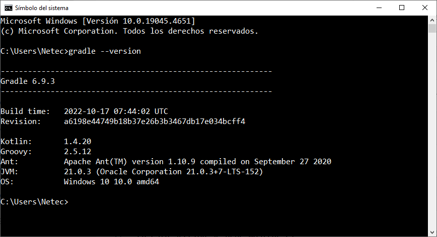
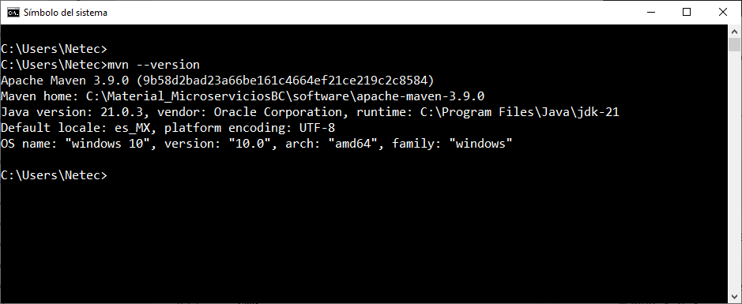
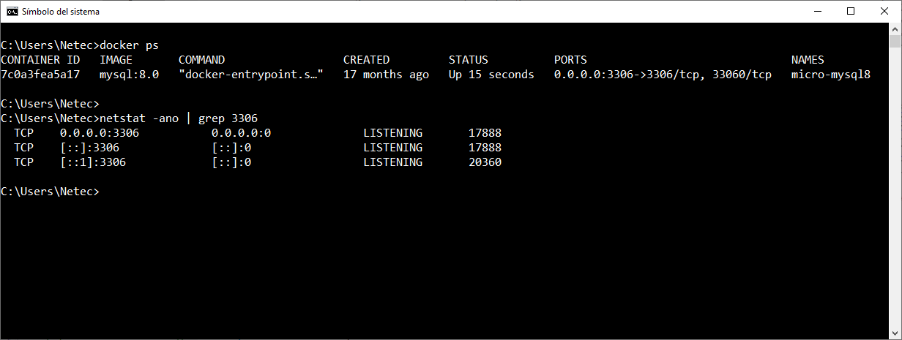
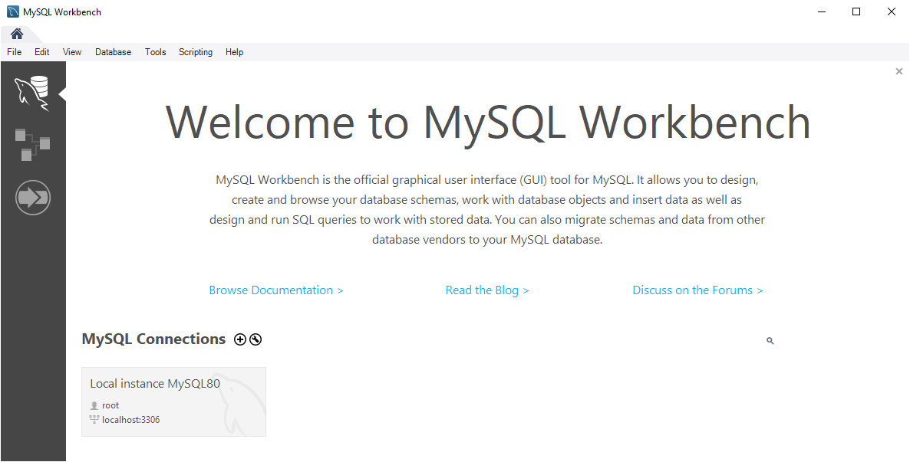

# Práctica 3.1. Configuración del Entorno para Spring Boot 

## Objetivo de la práctica:
Al finalizar la práctica, serás capaz de:
- Configurar el entorno de desarrollo necesario para trabajar con Spring Boot, Spring Tool Suite (STS).

## Objetivo Visual

<div style="text-align: center;">
    
</div>


## Duración aproximada:
- 45 minutos.


## Instrucciones 

### Tarea 1. Verificación de la versión de JDK instalado.
**Paso 1.** Verificación de la instalación de de JDK instalado.<br>
```cmd
javac --version
```
```cmd
java --version
```
**Paso 2.** Configuración de la versión la configuración de la variable JAVA_HOME
```cmd
set | findstr JAVA  
```
 
### Tarea 2. Verificación de la versión de Gradle.

**Paso 1.** Ejecutar la instrucción para verificar si se cuenta con Gradle:
```cmd
gradle --version
```

**Paso 2.** Definir la variable GRADLE_HOME
```cmd
set GRADLE_HOME=<ruta Gradle>
```

**Paso 3.** Modificar el path
```cmd
set PATH=%PATH%;GRADLE_HOME%\bin
```

### Resultado esperado




### Tarea 3. Verificación de la versión de Maven.

**Paso 1.** Ejecutar la instrucción para verificar si se cuenta con Maven:
```cmd
mvn --version
```

**Paso 2.** Poner la variable de entorno PATH
```cmd
MVN_HOME=C:\<directorio>\apache-Maven-3.6.3
PATH=%PATH%;%MVN_HOME%\bin
```

### Resultado esperado




### Tarea 4. Verificación del IDE para el desarrollo de aplicaciones en Java

**Paso 1.** Localiza el ícono siguiente e inicia el STS e inicia el STS

<div style="text-align: center;">
    
</div>

**Paso 2.** Localiza el ícono siguiente e inicia Postman

<div style="text-align: center;">
    
</div>

**Paso 3.** Localiza el ícono siguiente e inicia Insomia

<div style="text-align: center;">
    
</div>


### Tarea 5. Verifica el contenedor MySQLServer

**Paso 1.** Verifica si tienes Docker instalado y el contenedor de MySQL<br/>
<small>
* Puede ser que en tu entorno no se utilice Docker. Por favor, confirma con tu instructor.
</small>

```cmd
docker ps
```

**Paso 2.** Verifica los puertos disponibles para MySQL

```cmd
netstat -ano | findstr 3306
```

<div style="text-align: center;">
    
</div>

**Paso 3.** Verifica si tienes instalado MySQL Workbench (Opcional)

```cmd
mysqlworkbench --version
```

<div style="text-align: center;">
    
</div>

**Paso 4.** Conectate al servidor MySQL

```cmd
mysql -uroot -pNetec_2357 -hlocalhost
```

**Paso 5.** Crea una base de datos, usa la base de datos, crea una tabla, inserta valores y consulta la información ingresada.

```sql
-- Crea una base de datos
CREATE DATABASE mi_base_de_datos;

-- Selecciona la base de datos
USE mi_base_de_datos;

-- Crea una tabla con dos campos
CREATE TABLE mi_tabla (
    id INT PRIMARY KEY,
    nombre VARCHAR(100)
);

-- Inserta datos en la tabla
INSERT INTO mi_tabla (id, nombre) VALUES (1, 'Everardo');
INSERT INTO mi_tabla (id, nombre) VALUES (2, 'Greta');
INSERT INTO mi_tabla (id, nombre) VALUES (3, 'Jesús');

-- Consulta los datos de la tabla
SELECT * FROM mi_tabla;
```
