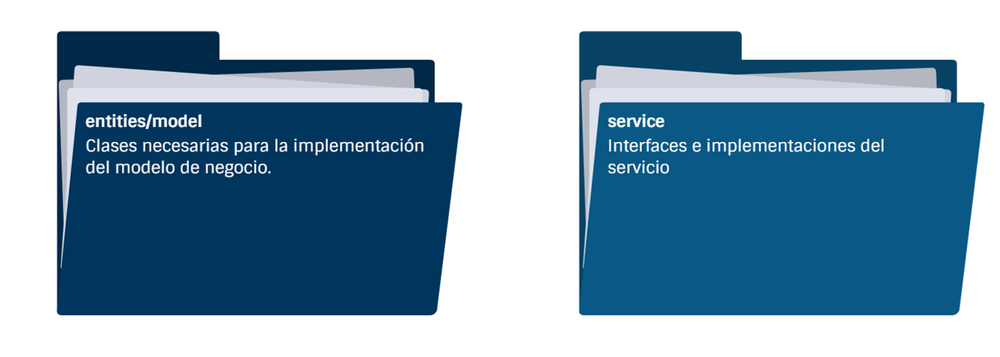

# Práctica 3.2. Creación de un Proyecto Inicial con Spring Boot 

## Objetivo de la práctica:
Al finalizar la práctica, serás capaz de:
- Configurar y generar un proyecto básico con Spring Boot, estableciendo una base sólida para el desarrollo de aplicaciones orientadas a microservicios.

## Objetivo Visual:

<div style="text-align: center;">
    
</div>

## Duración aproximada:
- 30 minutos.


## Instrucciones: 

### Tarea 1. Crear un nuevo proyecto Spring Boot, usando Java 21, Maven y empaquetamiento JAR.

**Paso 1.** Inicia STS.

**Paso 2.** Selecciona un espacio de trabajo para tu nuevo proyecto.

**Paso 3.** Usa Spring Boot, con Java 21, Maven y empaquetamiento JAR.


### Tarea 2. Agrega los inicializadores.

**Paso 1.** Spring Web & Spring Boot Dev Tools.

### Tarea 3. Crea y codifica.

**Paso 1.** Crea la entidad `Producto`:

```java
public class Producto {

    private int id;
    private String nombre;
    private double precio;

    public Producto() {
        super();
    }

    public Producto(int id, String nombre, double precio) {
        super();
        this.id = id;
        this.nombre = nombre;
        this.precio = precio;
    }

    // Getters & Setters
    // Líneas omitidas
}

```

**Paso 2.** Crea la interfaz `IProductoServicio`:

```java
package com.netec.practica32.service;
import java.util.List;
import com.netec.practica32.entities.Producto;

public abstract interface IProductoService {
    public abstract List<Producto> findAll();
    Producto findById(int id);
}

```

**Paso 3.** Crea la clase `ProductoServicio` que implemente la interfaz del punto anterior:

```java
package com.netec.practica32.service;

import java.util.Arrays;
import java.util.List;
import org.springframework.stereotype.Service;
import com.netec.practica32.entities.Producto;

@Service
public class ProductoServiceImpl implements IProductoService {

    private List<Producto> productos = Arrays.asList(
        new Producto(1, "Producto A", 100.0),
        new Producto(2, "Producto B", 200.0), 
        new Producto(3, "Producto C", 300.0),
        new Producto(4, "Producto D", 400.0));

    @Override
    public List<Producto> findAll() {
        return productos;
    }

    @Override
    public Producto findById(int id) {
        for (Producto producto : productos) {
            if (producto.getId() == id) {
                return producto;
            }
        }
        return null;
    }
}

```
[Inicio](../README.md)<br>
[Práctica 3.1. Configuración del Entorno para Spring Boot](../Capítulo3/README 3.1..md)<br>
[Práctica 3.3. Implementación de Endpoints REST en Spring Boot.](../Capítulo3/README 3.3..md)<br>
