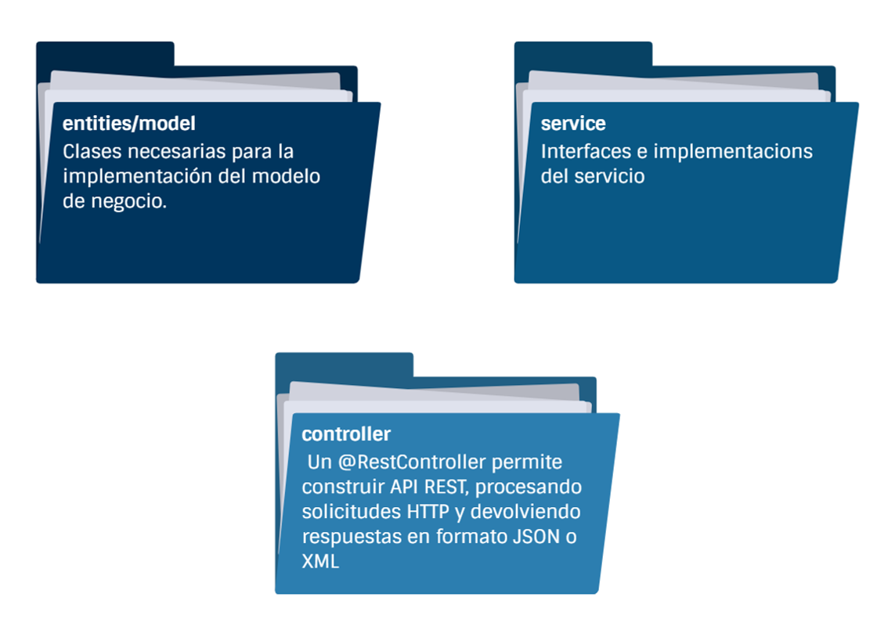

# Práctica 3.3. Implementación de Endpoints REST en Spring Boot 

## Objetivo de la práctica:
Al finalizar la práctica, serás capaz de:
- Implementar endpoints RESTful utilizando Spring Boot, permitiendo la lectura de recursos mediante servicios web.

## Objetivo Visual:

<div style="text-align: center;">
    
</div>

## Duración aproximada:
- 45 minutos.

## Endpoints:

| Método | URI/Endpoints                      |
|--------|------------------------------------|
| GET    | http://localhost:9999/productos    |
| GET    | http://localhost:9999/producto/1   |


## Instrucciones: 

### Tarea 1. Crea un controlador REST.

**Paso 1.** Utiliza las anotaciones `@RestController`, `@GetMapping` y `@PathVariable` para definir los endpoints que consumen el servicio implementado:


```java
package com.netec.practica32.controller;

import java.util.List;
import org.springframework.beans.factory.annotation.Autowired;
import org.springframework.web.bind.annotation.GetMapping;
import org.springframework.web.bind.annotation.PathVariable;
import org.springframework.web.bind.annotation.RestController;

import com.netec.practica32.entities.Producto;
import com.netec.practica32.service.IProductoService;

@RestController
public class ProductoController {

    @Autowired
    private IProductoService servicio;

    @GetMapping("/producto")
    public List<Producto> findAll() {
        return servicio.findAll();
    }

    @GetMapping("/producto/{id}")
    public Producto findById(@PathVariable("id") int id) {
        return servicio.findById(id);
    }
}

```
[Inicio](../README.md)<br>
[Práctica 3.2. Creación de un Proyecto Inicial con Spring Boot](../Capítulo3/README 3.2..md)<br>
[Práctica 3.4. Configuración de Propiedades en Spring Boot](../Capítulo3/README 3.4..md)<br>
