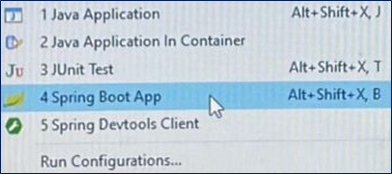

# Práctica 3.4. Configuración de Propiedades en Spring Boot 

## Objetivo de la práctica:
Al finalizar la práctica, serás capaz de:
- Configurar y gestionar propiedades en una aplicación Spring Boot, utilizando archivos de configuración.

## Duración aproximada:
- 30 minutos.

## Instrucciones 

### Tarea 1. Configurar propiedades en Spring Boot

**Paso 1.** Modifica el archivo application.properties con las propiedades del cuadro siguiente:

```properties
spring.application.name=practica32
server.port=9999
```

### Tarea 2. Desplegar el servicio

**Paso 1.** Haz clic derecho en la clase principal del proyecto en Spring Boot. Selecciona **Run As** > **Spring Boot App**

<div style="text-align: center;">
    
</div>


### Tarea 3. Consumir el servicio

**Paso 1.** Usa Postman o un navegador y consume el servicio, prubeas las URIs que hayas implementado en el servicio.

### Tarea 4. Comentar experiencia adquirida

**Paso 1.** Comenta la actividad realizada

* ¿El proyecto cambiaría si este se realiza con Gradle en lugar de Maven?
* ¿Que tendrías que realizar para levantar otra instancia?


### Tarea 5. Trabajar con Logger

**Paso 1.** Modifica el código para registrar un mensaje con Logger.

 * Modifica el archivo src/main/resources/application.properties
 * Añade la variable **participant.name**, con tu nombre
 * Modifica el método main para registrar un mensaje con tu nombre usando Logger.
 
```properties
spring.application.name=practica32
server.port=9999
participant.name="MI_NOMBRE"
```

* Puedes utilizar el siguiente código como referencia para modificar la clase principal del servicio:

```java

package com.netec.practica32;

import org.slf4j.Logger;
import org.slf4j.LoggerFactory;
import org.springframework.beans.factory.annotation.Value;
import org.springframework.boot.SpringApplication;
import org.springframework.boot.autoconfigure.SpringBootApplication;

import jakarta.annotation.PostConstruct;

@SpringBootApplication
public class Practica32Application {
    private static final Logger logger = LoggerFactory.getLogger(Practica32Application.class);

    @Value("${participant.name}")
    private String participantName;
   
    public static void main(String[] args) {
        SpringApplication.run(Practica32Application.class, args);
    }

    @PostConstruct
    public void displayParticipantName() {
        logger.info("Nombre del participante: " + participantName);
    }
}

```