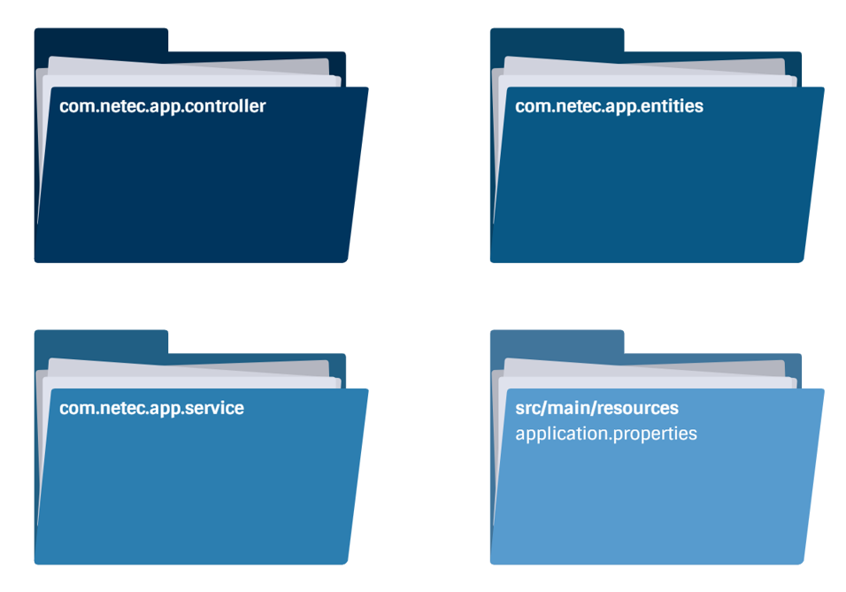
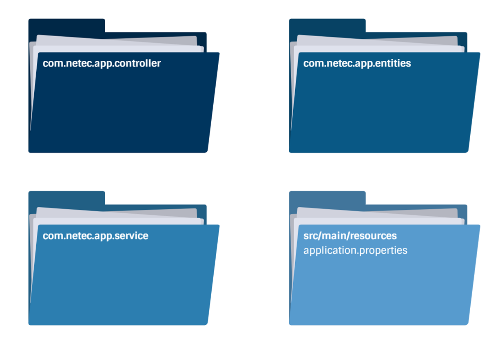

# Práctica 4.1. Creación de un Proyecto con Microservicios 

## Objetivo de la práctica:
Al finalizar la práctica, serás capaz de:
- Implementar un microservicio con entidades, servicios y controladores, utilizando Spring.

## Objetivo Visual

    

## Duración aproximada:
- 45 minutos.

## Instrucciones 

### Tarea 1. Creación un nuevo proyecto Spring Boot

**Paso 1.** Crear un nuevo proyecto de tipo Spring Boot, 
* **Name**: micro-articulo
* **Type**: Maven
* **Packaging**: Jar
* **Java Version**: 21
* **Language**: Java
* **Group**: com.netec.micro_articulo
* **Version**: 0.0.1-SNAPSHOT
* **Description**: Implementación del microservicio micro-articulo
* **package**: com.netec.micro_articulo

### Tarea 2. Añadir los inicializadores.

**Paso 1.** Agrega los inicializadores:

* Spring Web
* Spring Boot Dev Tools

### Tarea 3. Implementar el microservicio: micro-articulo

**Paso 1.** Los endpoints podrías ser los siguientes:

| Método | URI/Endpoints                     | Cuerpo  |
|--------|----------------------------------|--------|
| GET    | /articulo  | N/A |
| GET    | /articulo/{id} | N/A |
| POST   | /articulo | JSON |
| DELETE | /articulo/{id}  | N/A   |

### Tarea 3. Aterrizar el contenido de cada archivo
**Paso 1.** ¿Qué elementos son relevantes en el desarrollo del microservicio micro-articulo dentro de las siguientes carpetas y archivos?

* com.netec.app.controlador
* com.netec.app.entities
* com.netec.app.service
* src/main/resources/application.properties

    

