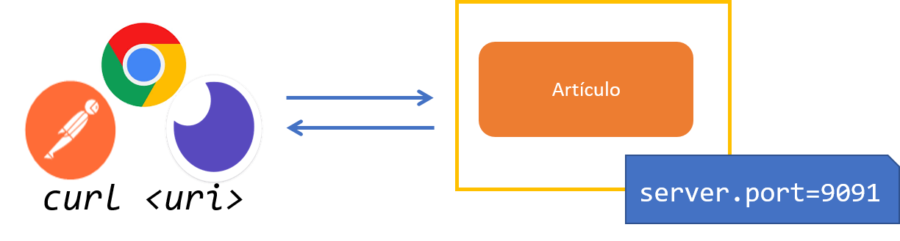
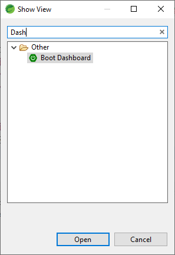
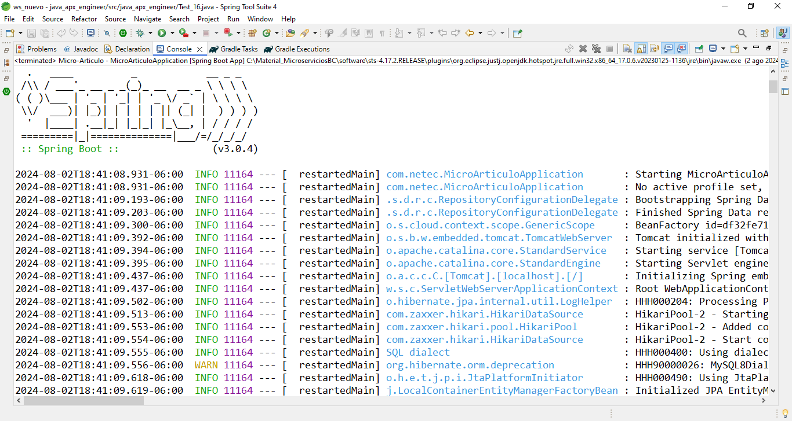
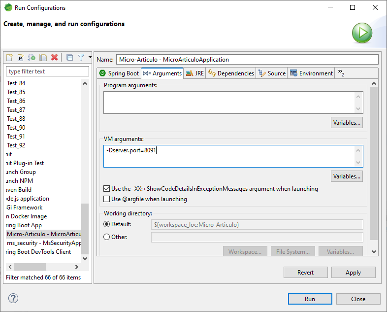

# Práctica 4.2. Configuración, Implementación, Despliegue y Pruebas del Microservicio

## Objetivo de la práctica:
Al finalizar la práctica, serás capaz de:
- Configurar y desplegar el microservicio, así como realizar pruebas de sus endpoints utilizando una herramienta de pruebas de API.

## Objetivo Visual

<div style="text-align: center;">
    
</div>


## Duración aproximada:
- 75 minutos.

## Instrucciones 

### Tarea 1. Configurar el microservicio
**Paso 1.** Abre el archivo **application.properties** ubicado en src/main/resources.

**Paso 2**. Añade las siguientes propiedades:

```properties
spring.application.name=micro-articulo
server.port=9091  # Puedes cambiar el puerto si es necesario
```

### Tarea 2. Levantar el microservicio.

**Paso 1.** Ejecuta la aplicación desde tu IDE (STS) o utilizando la línea de comandos.

```cmd
mvn spring-boot:run
```

### Tarea 3. Revisar el Boot Dashboard.

**Paso 1.** Para encontrar el Boot Dashboard de Spring Tool Suite, sigue estos pasos:

* En la barra de menú superior, selecciona **Window**.
* En el menú desplegable, selecciona **Show View**.
* A continuación, selecciona **Other...** para abrir el cuadro de diálogo de vistas adicionales.
* Busca y selecciona **Boot Dashboard**


<div style="text-align: center;">
    
</div>


### Tarea 4. Verificar los mensajes en la consola.

**Paso 1.** Para acceder a los mensajes de la consola cuando se ejecuta un microservicio en Spring Tool Suite (STS), sigue estos pasos:

* Una vez que el microservicio esté en ejecución, busca la vista de la consola en la parte inferior de la ventana de STS.

* Si no ves la vista de la consola, puedes abrirla manualmente dirigiéndote a la barra de menú superior, seleccionando Window, luego Show View, y finalmente Console.

<div style="text-align: center;">
    
</div>

### Tarea 5. Consumir el microservicio

**Paso 1.** Usa Postman o Insomia para consumir el microservicio, básate en el siguiente JSON

> **Nota:** Puedes encontrar más información en el [sitio oficial de JSON](https://www.json.org/json-es.html).


```json
{
  "id": 1,
  "nombre": "Producto Ejemplo",
  "marca": "Marca Ejemplo",
  "descripcion": "Descripción del producto incluir detalles relevantes.",
  "precio": 29.99
}
```

### Tarea 6. Gestionar varias instancias.

**Paso 1.** Vuelve a iniciar el microservicio, apágalo y enciéndolo nuevamente, o incluso levanta otra instancia.

* Navega hasta tu proyecto de microservicio en el Explorador de Proyectos.
* Haz clic derecho sobre el proyecto y selecciona Run As.
* A continuación, elige Run Configurations....

<div style="text-align: center;">
    
</div>

### Tarea 7. Verificar las instancias en ejecución.

**Paso 1.** Asegúrate de que ambas instancias del microservicio están en ejecución comprobando los mensajes de la consola.

**Paso 2.** Puedes acceder a las aplicaciones a través de los puertos especificados en tu navegador o mediante herramientas de prueba como Postman.

### Tarea 8. Conclusiones

**Paso 1.** ¿Qué observas sobre los artículos agregados?

