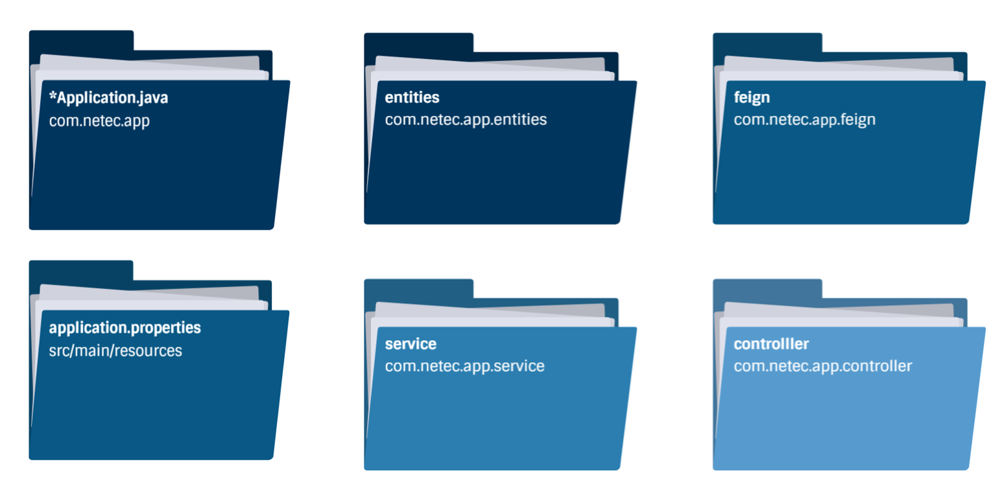

# Práctica 5.2. Clientes REST declarativos con Feign 

## Objetivo de la práctica:
Al finalizar la práctica, serás capaz de:
- Crear y configurar un segundo microservicio que se comunique de manera eficiente con el microservicio de artículos.

## Objetivo Visual 
Crear un diagrama o imagen que resuma las actividades a realizar, un ejemplo es la siguiente imagen. 


## Duración aproximada:
- 45 minutos.

## Tabla de ayuda:
Agregar una tabla con la información que pueda requerir el participante durante el laboratorio, como versión de software, IPs de servers, usuarios y credenciales de acceso.
| Contraseña | Correo | Código |
| --- | --- | ---|
| Netec2024 | edgardo@netec.com | 123abc |

## Instrucciones 

### Tarea 1. Creación un nuevo proyecto Spring Boot
Paso 1. Crear un nuevo proyecto de tipo Spring Boot, 
* **Name**: micro-carritofeign
* **Type**: Maven
* **Packaging**: Jar
* **Java Version**: 21
* **Language**: Java
* **Group**: com.netec.micro_carritofeign
* **Version**: 0.0.1-SNAPSHOT
* **Description**: Implementación del microservicio micro-carritofeign
* **package**: com.netec.micro_carritofeign

Paso 2. Agrega los inicializadores:
* Spring Cloud Routing/OpeFeign
* Spring Web
* Spring Boot Dev Tools


### Tarea 2. Implementa el microservicio asociado a carrito
Paso 1. Crea los componentes necesarios para tener un microservicio cuyos endpoints podrían ser los siguientes:

| Método | URI/Endpoints                     | Cuerpo  |
|--------|----------------------------------|--------|
| POST   | /carrito  | JSON |
| GET    | /carrito | N/A |


Paso 2. Agrega la siguiente línea para configurarar el puerto del microservicio a 9092

```properties
spring.application.name=micro-carritof
spring.application.port=9093
```

Paso 3. Define a lógica para insertar un articulo recuperado del microservicio de articulos.

Paso 4. Utiliza **@FeignClient(name="<nombre>", url=<URI>)** para consumir desde el servicio de carrito al servicio de artículo.

Paso 5. Define una interface Java con la ruta para solicitar el artículo con un id especificado, el código puede ser similar al siguiente:


```java
package com.netec.app.feign;

import org.springframework.cloud.openfeign.FeignClient;
import org.springframework.web.bind.annotation.GetMapping;
import org.springframework.web.bind.annotation.PathVariable;
import com.netec.app.entities.Articulo;

@FeignClient(name="micro-articulo", url="http://localhost:9091")
public interface IArticuloFeign {
    @GetMapping("/articulo/{id}")
    public Articulo findById(@PathVariable("id") int id);
}

```

### Tarea 3. Conclusiones

 Paso 1. Describe los aspectos más relevantes de cada paquete y carpeta.

<div style="text-align: center;">
    
</div>