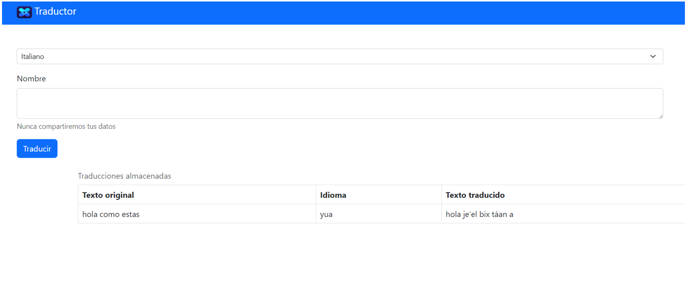

# Práctica 5.3. Pruebas de la Comunicación entre Microservicios 

## Objetivo de la práctica:
Al finalizar la práctica, serás capaz de:
- Crear y configurar un segundo microservicio que se comunique de manera eficiente con el microservicio de artículos utilizando Feign.

## Objetivo Visual 
Crear un diagrama o imagen que resuma las actividades a realizar, un ejemplo es la siguiente imagen. 

## Duración aproximada:
- 30 minutos.

## Tabla de ayuda:
Agregar una tabla con la información que pueda requerir el participante durante el laboratorio, como versión de software, IPs de servers, usuarios y credenciales de acceso.
| Contraseña | Correo | Código |
| --- | --- | ---|
| Netec2024 | edgardo@netec.com | 123abc |

## Instrucciones 

### Tarea 1. Ejecución del micro-carritof
Paso 1. Ejecuta el proyecto micro-carritof

Paso 2. Prueba los endpoints utilizando las herramientas Postman o Curl

| Método | URI/Endpoints                     | Cuerpo  |
|--------|----------------------------------|--------|
| POST   | /carrito  | JSON |
| GET    | /carrito | N/A |

 

### Resultado esperado
En esta sección se debe mostrar el resultado esperado de nuestro laboratorio

