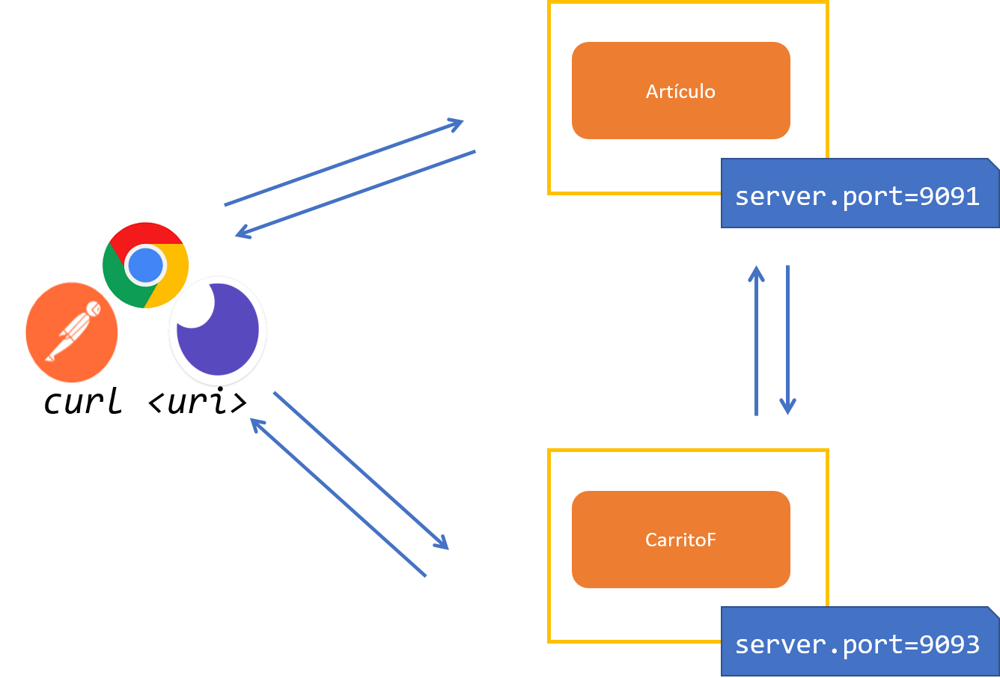

# Práctica 5.3. Pruebas de la Comunicación entre Microservicios 

## Objetivo de la práctica:
Al finalizar la práctica, serás capaz de:
- Crear y configurar un segundo microservicio que se comunique de manera eficiente con el microservicio de artículos utilizando Feign.

## Objetivo Visual:

    

## Duración aproximada:
- 30 minutos.

## Instrucciones: 

### Tarea 1. Ejecución del micro-carritof.

**Paso 1.** Ejecuta el proyecto micro-carritof.

**Paso 2.** Prueba los Endpoints utilizando las herramientas Postman o Curl.

| Método | URI/Endpoints                     | Cuerpo  |
|--------|----------------------------------|--------|
| POST   | /carrito  | JSON |
| GET    | /carrito | N/A |

 [Inicio](../README.md) 
[Práctica 5.2. Clientes REST declarativos con Feign](../Capítulo5/README 5.2..md) 
[Práctica 6.1. Definición del Esquema de la Base de Datos que Soporte el Microservicio](../Capítulo6/README 6.1..md) 
