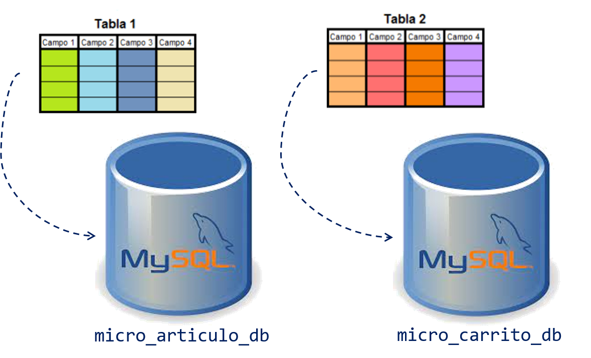
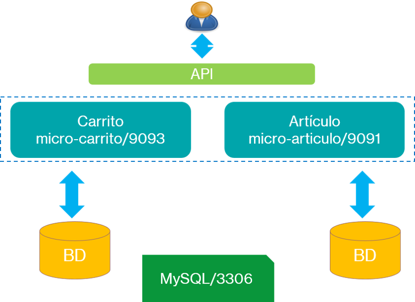

# Practica 6.2. Implementación del Repositorio en el Microservicio 

## Objetivo de la práctica:
Al finalizar la práctica, serás capaz de:
- Implementar el repositorio en el microservicio, utilizando Spring Data JPA para gestionar las operaciones de persistencia de manera eficiente.


## Objetivo Visual

<div style="text-align: center;">
    
</div>

## Duración aproximada:
- 45 minutos.

## Instrucciones 

### Tarea 1. Veriricación de acceso a la base de datos MySQL

**Paso 1.** Varificar que puede tener acceso a la base de datos MySQL

```cmd
mysql -uroot -pNetec_2357 -hlocalhost
```

**Paso 2.** Verificar las bases de datos creadas

```sql
show databases;
```


### Tarea 2. Modificar los proyectos asociados a los microservicios

**Paso 1.** Agrega el inicializador
* MySQL Driver


**Paso 2.** Verifica que tienes el incializador Spring Data JPA

* Analiza el contenido del archivo **pom.xml** o **gradle.build** en la sección de dependencias.

**Paso 3.** Define y mapea las entidades JPS a las tablas de la base de datos.

**Paso 4.** Agregar las anotaciones pertinentes a la clase Articulo en el microservicio micro-articulo

**Paso 5.** Crea repositorios JPS para realizar las operaciones CRUD sobre las entidades encontradas.

### Resultado esperado

<div style="text-align: center;">
    
</div>


