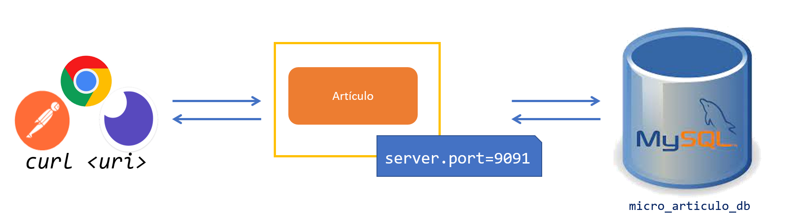

# Practica 6.3. Configuración de la Persistencia 

## Objetivo de la práctica:
Al finalizar la práctica, serás capaz de:
- Configurar las propiedades necesarias en el archivo de propiedades, para establecer la conexión con una base de datos relacional.


## Objetivo Visual:

<div style="text-align: center;">
    
</div>


## Duración aproximada:
- 30 minutos.

## Instrucciones: 
### Tarea 1. Verificación de acceso a la base de datos MySQL.

**Paso 1.** Verificar que se tiene acceso a la base de datos MySQL:

```cmd
mysql -uroot -pNetec_2357 -hlocalhost
```

**Paso 2.** Verificar las bases de datos creadas:

```sql
show databases
```

**Paso 2.** Agrega las siguientes líneas para configurarar el acceso a la base de datos:

```properties
# Lineas para MySQL
spring.jpa.hibernate.ddl-auto=update
spring.datasource.url=jdbc:mysql://<ip_address>:3306/micro_articulo_bd
spring.datasource.username=root
spring.datasource.password=Netec_2357
```


